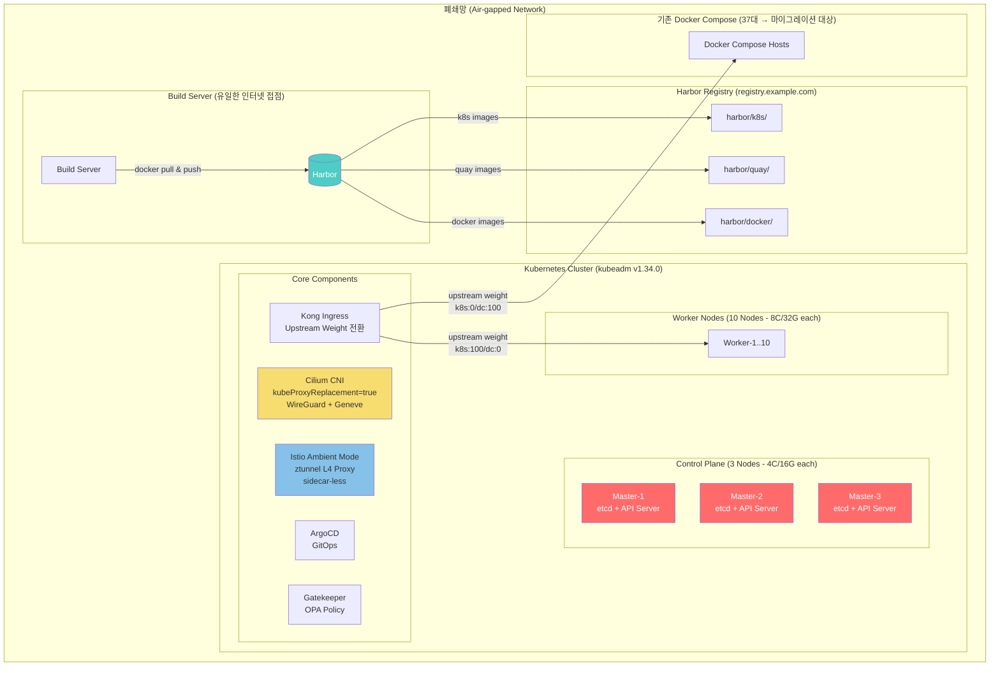

# 01. Kubernetes Platform Migration — 기술 심화 가이드

> **지원자 프로필**: 1년차 DevOps, 스마일게이트, 1인 DevOps
> **핵심 성과**: Docker Compose 37대 → K8s 22대 전환 (서버 40% 절감), 폐쇄망 kubeadm HA 구축
> **운영 규모**: 서버 77대 (DEV/STG/LIVE), Master 3 + Worker 10

---

## 1. 아키텍처 Overview



### 핵심 수치 요약

| 항목           | 수치                                        |
|--------------|-------------------------------------------|
| 서버 절감        | 37대 → 22대 (40% 절감)                        |
| Master Node  | 3대 (4C/16G), etcd HA                      |
| Worker Node  | 10대 (8C/32G)                              |
| kubeadm 버전   | v1.34.0                                   |
| CNI          | Cilium (kube-proxy 대체, WireGuard, Geneve) |
| Service Mesh | Istio Ambient Mode (sidecar-less)         |
| 네임스페이스       | prod (64CPU/256Gi ResourceQuota)      |
| Helm         | Umbrella Chart (10 subcharts)             |
| 전환 기간        | 16주 (dev → stg → live 순차)                 |
| 롤백 기준        | Error Rate >1% 5분 지속 또는 P99 2배 초과 15분 미개선 |

---

## 2. 핵심 설정 해설 (반드시 숙지)

### 2.1 폐쇄망(Air-gap) 이미지 공급 체계

**왜 이 구조인가?**

폐쇄망에서는 인터넷에 접근할 수 없으므로 모든 컨테이너 이미지를 내부 레지스트리에서 공급해야 한다. Harbor를 중앙 이미지 저장소로 사용하고, containerd의 mirror 설정으로 원본 레지스트리 요청을
Harbor로 리다이렉트한다.

**containerd mirror 설정 (certs.d 방식)**

```
# /etc/containerd/certs.d/registry.k8s.io/hosts.toml
server = "https://registry.k8s.io"

[host."https://registry.example.com"]
  capabilities = ["pull", "resolve"]
  override_path = true   # Harbor의 프로젝트 경로를 그대로 사용

# /etc/containerd/certs.d/quay.io/hosts.toml
server = "https://quay.io"

[host."https://registry.example.com"]
  capabilities = ["pull", "resolve"]
  override_path = true

# /etc/containerd/certs.d/docker.io/hosts.toml
server = "https://docker.io"

[host."https://registry.example.com"]
  capabilities = ["pull", "resolve"]
  override_path = true
```

**이미지 공급 플로우**

```
Build Server (인터넷 가능)
  └─ docker pull registry.k8s.io/kube-apiserver:v1.34.0
  └─ docker tag → registry.example.com/k8s/kube-apiserver:v1.34.0
  └─ docker push → Harbor

Worker Node (폐쇄망)
  └─ kubelet이 registry.k8s.io/kube-apiserver:v1.34.0 요청
  └─ containerd가 certs.d 설정에 따라 Harbor로 리다이렉트
  └─ registry.example.com/k8s/kube-apiserver:v1.34.0 pull
```

**kubeadm에서의 이미지 지정**

```yaml
# kubeadm-config.yaml
apiVersion: kubeadm.k8s.io/v1beta4
kind: ClusterConfiguration
imageRepository: "registry.example.com/k8s"
```

**핵심 포인트**:

1. **certs.d 방식 vs config.toml 방식**: certs.d는 containerd 1.5+에서 도입된 공식 권장 방식. 레지스트리별로 `hosts.toml`을 분리하여 관리가 용이하고,
   containerd 재시작 없이 설정 변경 가능. config.toml의 `[plugins."io.containerd.grpc.v1.cri".registry.mirrors]`는 deprecated 경로.
2. **Harbor 이미지 동기화 전략**: Build Server에서 인터넷 pull → Harbor push. 버전 업그레이드 시 `kubeadm config images list`로 필요한 이미지 목록을 사전
   확인하고 Harbor에 미리 push.
3. **override_path=true의 의미**: 원본 레지스트리의 경로를 무시하고 Harbor 프로젝트의 경로 체계를 사용. 예를 들어 `registry.k8s.io/kube-apiserver` →
   `registry.example.com/k8s/kube-apiserver`.

---

### 2.2 kubeadm HA 클러스터 부트스트랩

**왜 kubeadm인가?**

폐쇄망에서 EKS/GKE 같은 매니지드 서비스를 사용할 수 없고, 바이너리 기반으로 클러스터를 구성할 수 있는 공식 도구가 kubeadm이다. Kubernetes SIG에서 공식 관리하며, CKA/CKS 시험에서도
사용하는 표준 부트스트래핑 도구.

**kubeadm init 핵심 옵션**

```bash
kubeadm init \
  --config kubeadm-config.yaml \
  --upload-certs \
  --skip-phases=addon/kube-proxy
```

| 옵션                               | 의미                              | 왜 사용했나                                                                                                                           |
|----------------------------------|---------------------------------|----------------------------------------------------------------------------------------------------------------------------------|
| `--config`                       | 선언적 설정 파일 사용                    | CLI 플래그 나열 대신 YAML로 관리하여 Git 추적 가능, 재현성 보장                                                                                       |
| `--upload-certs`                 | Control Plane 인증서를 Secret으로 업로드 | 추가 Master 노드 조인 시 인증서를 수동 복사할 필요 없음 (2시간 TTL)                                                                                    |
| `--skip-phases=addon/kube-proxy` | kube-proxy DaemonSet 설치 건너뛰기    | **Cilium이 kube-proxy를 완전 대체**(kubeProxyReplacement=true)하므로 충돌 방지. kube-proxy의 iptables 규칙과 Cilium의 eBPF 규칙이 공존하면 예측 불가능한 라우팅 발생 |

**kubeadm-config.yaml 핵심**

```yaml
apiVersion: kubeadm.k8s.io/v1beta4
kind: ClusterConfiguration
kubernetesVersion: "v1.34.0"
imageRepository: "registry.example.com/k8s"
controlPlaneEndpoint: "<LB-VIP>:6443"    # HA를 위한 VIP
networking:
  podSubnet: "10.244.0.0/16"
  serviceSubnet: "10.96.0.0/12"
etcd:
  local:
    dataDir: /var/lib/etcd
---
apiVersion: kubeadm.k8s.io/v1beta4
kind: InitConfiguration
skipPhases:
  - addon/kube-proxy
```

**노드 사전 설정 (왜 이것들이 필요한가)**

```bash
# SELinux permissive — 컨테이너가 호스트 파일시스템에 접근해야 하는 경우 차단 방지
# 프로덕션에서는 enforcing + 적절한 policy가 이상적이나, 초기 구축 안정성 우선
setenforce 0
sed -i 's/^SELINUX=enforcing$/SELINUX=permissive/' /etc/selinux/config

# Swap off — kubelet은 기본적으로 swap이 켜져 있으면 시작을 거부
# 메모리 request/limits 기반 스케줄링의 정확성을 보장하기 위해
swapoff -a
sed -i '/swap/d' /etc/fstab

# 커널 모듈 로드
modprobe br_netfilter   # 브릿지 트래픽이 iptables 규칙을 통과하도록
modprobe overlay         # overlayfs (containerd 스토리지 드라이버)
modprobe wireguard       # Cilium WireGuard 암호화에 필요
```

**sysctl 설정과 이유**

| sysctl 파라미터                          | 값       | 이유                                                              |
|--------------------------------------|---------|-----------------------------------------------------------------|
| `net.bridge.bridge-nf-call-iptables` | 1       | 브릿지 네트워크의 패킷이 iptables/netfilter를 통과하도록. K8s Service 라우팅의 전제 조건 |
| `net.ipv4.ip_forward`                | 1       | Pod 간 통신, 노드 간 라우팅에 필수. 리눅스가 라우터 역할을 하려면 IP 포워딩 활성화 필요          |
| `net.core.somaxconn`                 | 8192    | TCP listen backlog 큐 크기. 기본값 128은 대규모 서비스에서 connection drop 유발  |
| `fs.file-max`                        | 2097152 | 시스템 전체 파일 디스크립터 최대값. 많은 Pod가 동시에 파일/소켓을 열 때 한계치 방지              |

**방화벽 포트 정리**

```
# Master Nodes
6443        — kube-apiserver (클라이언트 → API 서버)
2379-2380   — etcd (peer 통신 + 클라이언트 통신)
10250       — kubelet API (API 서버 → kubelet)
10257       — kube-controller-manager (self)
10259       — kube-scheduler (self)

# Cilium
8472/UDP    — VXLAN (사용 안 함, Geneve 사용)
6081/UDP    — Geneve 터널 (Pod-to-Pod 크로스 노드 통신)
4240/TCP    — Cilium Health Check
4244-4245/TCP — Hubble (관측성)
51871/UDP   — WireGuard (노드 간 암호화 터널)

# Istio Ambient Mode
15008/TCP   — HBONE 터널 (ztunnel 간 mTLS 통신)
15012/TCP   — istiod xDS (설정 배포)
15014/TCP   — istiod metrics
15017/TCP   — istiod webhook
```

---

### 2.3 Cilium CNI 설정

**왜 Cilium인가?**

1. **eBPF 기반**: 커널 레벨에서 패킷 처리. iptables 체인을 우회하여 대규모 Service 환경에서 성능 저하 없음. iptables는 O(n) 규칙 매칭이라 서비스 수 증가 시 레이턴시 증가.
2. **kube-proxy 완전 대체**: eBPF로 ClusterIP/NodePort/LoadBalancer를 처리. kube-proxy의 conntrack 이슈, iptables 규칙 폭발 문제 해결.
3. **WireGuard 내장**: 별도 VPN 솔루션 없이 노드 간 트래픽 암호화. 폐쇄망이지만 내부 네트워크 세그먼트 간 암호화가 보안 감사 요건.
4. **Hubble**: 네트워크 관측성을 별도 도구 없이 제공. L3/L4/L7 플로우 가시성.

**Cilium Helm values 핵심 설정**

```yaml
# Cilium values.yaml (핵심 발췌)
kubeProxyReplacement: "true"          # kube-proxy 완전 대체
k8sServiceHost: "<API-SERVER-VIP>"     # kube-proxy 없이 API Server 접근
k8sServicePort: "6443"

tunnel: "geneve"                       # VXLAN 대비 확장성, MTU 효율성 우수
encryption:
  enabled: true
  type: wireguard                      # 노드 간 트래픽 암호화

hubble:
  enabled: true
  relay:
    enabled: true
  ui:
    enabled: true

# Istio Ambient Mode 공존 설정
socketLB:
  hostNamespaceOnly: true              # host namespace에서만 socket LB 적용
  # Pod namespace는 Istio ztunnel이 처리
cni:
  exclusive: false                     # Istio CNI 플러그인이 함께 설치될 수 있도록
  chainingMode: "none"                 # Cilium이 primary CNI
```

**kubeProxyReplacement=true의 동작 원리**

```
[기존 kube-proxy 방식]
Client → iptables/IPVS 규칙 → Service ClusterIP → Pod
         (규칙이 O(n)으로 증가)

[Cilium eBPF 방식]
Client → eBPF map lookup (O(1)) → Pod
         (커널 레벨에서 직접 라우팅, conntrack 부하 감소)
```

- eBPF는 커널 내부에 hash map을 유지하며, Service → Endpoint 매핑을 O(1)로 조회
- kube-proxy의 iptables 규칙은 서비스가 수백 개가 되면 수천 개의 규칙이 생기고 매 패킷마다 순차 매칭
- Cilium은 `BPF_MAP_TYPE_HASH`로 직접 매핑하므로 서비스 수에 무관한 성능

**Cilium + Istio 공존 설정 해설**

| 설정                                | 값                          | 왜                                                                                 |
|-----------------------------------|----------------------------|-----------------------------------------------------------------------------------|
| `socketLB.hostNamespaceOnly=true` | Host NS에서만 socket-level LB | Pod NS의 트래픽은 Istio ztunnel이 L4 처리. 두 레이어가 동시에 socket LB를 하면 이중 NAT/라우팅 충돌 발생      |
| `cni.exclusive=false`             | CNI 설정 디렉토리 독점하지 않음        | Istio CNI 플러그인이 `/etc/cni/net.d/`에 함께 설치될 수 있도록. `true`면 Cilium이 다른 CNI 설정 파일을 삭제 |
| `cni.chainingMode=none`           | CNI 체이닝 비활성화               | Cilium이 primary CNI로 동작. Istio CNI는 Pod의 트래픽을 ztunnel로 리다이렉트하는 역할만 수행             |

---

### 2.4 Istio Ambient Mode

**왜 Ambient Mode인가?**

1. **Sidecar 오버헤드 제거**: 전통적 Istio는 모든 Pod에 Envoy sidecar를 주입. Pod당 ~100MB 메모리 + ~50m CPU. Worker 10대에 수백 개 Pod 배포 시 리소스
   낭비가 심각.
2. **운영 복잡성 감소**: sidecar injection, sidecar 버전 관리, 앱 재시작 필요 등의 운영 부담 제거.
3. **ztunnel (Zero Trust Tunnel)**: 노드 레벨에서 DaemonSet으로 동작하는 L4 프록시. mTLS를 자동으로 제공하면서 sidecar 불필요.

**Ambient Mode 아키텍처**

```
[Sidecar Mode]
Pod-A (App + Envoy) ──mTLS──→ Pod-B (App + Envoy)
  └─ Pod당 sidecar 필요, 리소스 오버헤드

[Ambient Mode]
Pod-A (App only)
  └─ ztunnel (DaemonSet, 노드당 1개)
       └──HBONE (HTTP/2 + mTLS)──→ ztunnel (상대 노드)
                                        └─ Pod-B (App only)
```

**핵심 설정**

```yaml
# 네임스페이스에 Ambient Mode 활성화
  kubectl label namespace prod istio.io/dataplane-mode=ambient

# PeerAuthentication — mTLS STRICT 강제
apiVersion: security.istio.io/v1
kind: PeerAuthentication
metadata:
  name: default
  namespace: prod
spec:
  mtls:
    mode: STRICT   # 평문 트래픽 완전 차단, mTLS만 허용
```

**HBONE (HTTP-Based Overlay Network Encapsulation)**:

- ztunnel 간 통신 프로토콜. HTTP/2 CONNECT를 터널로 사용.
- 포트 15008에서 수신. mTLS가 기본 내장.
- 기존 Envoy sidecar의 전체 L7 기능은 없지만, L4 수준의 mTLS + 인증/인가를 제공.

**핵심 포인트**:

1. **L4 vs L7**: Ambient Mode의 ztunnel은 L4까지만 처리. L7 정책(HTTP 라우팅, 헤더 기반 라우팅 등)이 필요하면 waypoint proxy를 추가로 배포해야 함. 현재
   워크로드는 L4 mTLS만 필요하므로 waypoint 불필요.
2. **PeerAuthentication STRICT**: 네임스페이스 내 모든 서비스 간 통신이 mTLS만 허용. 평문 HTTP는 거부. 보안 감사 요건 충족.
3. **Cilium과의 역할 분담**: Cilium = L3/L4 네트워킹 + eBPF 기반 패킷 처리. Istio Ambient = L4 mTLS + 서비스 ID 기반 인증. 각자의 레이어에서 역할 분담.

---

### 2.5 무중단 마이그레이션 전략

**왜 Kong upstream weight 기반인가?**

DNS 기반 전환은 TTL 동안 구 환경으로 트래픽이 갈 수 있고, 롤백 시에도 TTL만큼 지연. Kong의 upstream weight는 즉시 반영되며, 비율 조절로 점진적 전환 + 즉시 롤백이 가능.

**3단계 무중단 전환**

```
[Phase 1: 병행 운영 (1~2주)]
Kong upstream:
  - target: docker-compose-host:8080  weight: 100
  - target: k8s-service.prod:80   weight: 0
→ K8s에 배포 완료, 내부 QA 테스트, 실 트래픽은 DC로

[Phase 2: 임시 도메인 검증 (1주)]
Kong upstream (임시 도메인):
  - target: k8s-service.prod:80   weight: 100
→ 임시 도메인으로 K8s에 직접 접근하여 E2E 검증

[Phase 3: 트래픽 스위칭 (1~2주)]
Kong upstream:
  - target: docker-compose-host:8080  weight: 0    ← 기존
  - target: k8s-service.prod:80   weight: 100  ← K8s
→ 메인 도메인 트래픽을 K8s로 전환, DC는 대기

[롤백 시 — 즉시]
Kong upstream:
  - target: docker-compose-host:8080  weight: 100  ← 즉시 복원
  - target: k8s-service.prod:80   weight: 0
```

**롤백 판단 기준**

| 조건          | 임계값                  | 액션                     |
|-------------|----------------------|------------------------|
| Error Rate  | >1%, 5분 지속           | 즉시 롤백 (Kong weight 전환) |
| P99 Latency | 기존 대비 2배 초과, 15분 미개선 | 롤백                     |
| 비즈니스 로직 오류  | 데이터 불일치 감지           | 즉시 롤백 + 원인 분석          |

**왜 이 기준인가**:

- Error Rate 1%는 100요청 중 1건 실패. 5분 지속이면 일시적 네트워크 이슈가 아닌 구조적 문제.
- P99 2배는 사용자 체감 성능 저하. 15분은 Pod 스케줄링, DNS 전파 등 일시적 성능 저하를 허용하는 안전 마진.
- 즉시 롤백이 가능한 이유: Kong upstream weight 변경은 API 호출 한 번. DNS TTL 대기 불필요.

**16주 타임라인**

```
Week 1-4:   DEV 환경 전환 + 안정화
Week 5-8:   STG 환경 전환 + 부하 테스트
Week 9-12:  LIVE Phase 1-2 (병행 운영 + 임시 도메인 검증)
Week 13-16: LIVE Phase 3 (트래픽 스위칭) + DC 해제
```

---

### 2.6 Helm Umbrella Chart

**왜 Umbrella Chart인가?**

10개 서비스를 개별 `helm install`로 관리하면 배포 순서, 버전 일관성, 환경별 values 관리가 복잡해진다. Umbrella Chart(parent chart)로 묶으면 단일
`helm upgrade`로 전체 플랫폼을 원자적으로 배포/롤백할 수 있다.

**Chart 구조**

```
service-platform/                    # Umbrella Chart (parent)
├── Chart.yaml                   # 10 subcharts를 dependency로 선언
├── values.yaml                  # 공통 설정
├── values-dev.yaml              # DEV 환경 오버라이드
├── values-stg.yaml              # STG 환경 오버라이드
├── values-live.yaml             # LIVE 환경 오버라이드
└── charts/
    ├── api-gateway/             # subchart 1
    ├── auth-service/            # subchart 2
    ├── batch-processor/         # subchart 3
    ├── ... (7 more)
    └── common/                  # 공통 템플릿 라이브러리
```

**condition 기반 활성화**

```yaml
# Chart.yaml
dependencies:
  - name: api-gateway
    version: "1.2.0"
    repository: "file://charts/api-gateway"
    condition: api-gateway.enabled     # values에서 true/false로 제어

  - name: batch-processor
    version: "1.0.0"
    repository: "file://charts/batch-processor"
    condition: batch-processor.enabled
```

```yaml
# values-dev.yaml — DEV에서는 batch-processor 비활성화
api-gateway:
  enabled: true
batch-processor:
  enabled: false   # DEV 환경에서는 배치 불필요

# values-live.yaml — LIVE에서는 전체 활성화
api-gateway:
  enabled: true
batch-processor:
  enabled: true
```

**핵심 포인트**:

1. **condition vs tags**: `condition`은 단일 subchart 제어, `tags`는 여러 subchart를 그룹으로 제어. 서비스 단위 제어가 필요하므로 condition 사용.
2. **원자적 배포**: `helm upgrade service-platform`으로 전체 서비스를 한 번에 배포. 실패 시 `helm rollback`으로 전체 롤백. 개별 배포 시 서비스 간 버전 불일치(version
   skew) 위험.
3. **ArgoCD 연동**: ArgoCD Application이 Umbrella Chart를 바라보고, Git의 values 변경을 감지하여 자동 Sync. 환경별 values 파일로 DEV/STG/LIVE
   분리.

---

### 2.7 리소스 거버넌스

**왜 ResourceQuota + LimitRange + PriorityClass 조합인가?**

1인 DevOps 환경에서 개발팀이 리소스를 무제한 사용하면 노드 자원 고갈 → 전체 서비스 장애. 자동화된 거버넌스로 사전 방지.

**ResourceQuota (네임스페이스 수준 총량 제한)**

```yaml
apiVersion: v1
kind: ResourceQuota
metadata:
  name: prod-quota
  namespace: prod
spec:
  hard:
    requests.cpu: "48"        # 총 CPU request 합계 48코어 제한
    requests.memory: "192Gi"  # 총 메모리 request 합계
    limits.cpu: "64"          # 총 CPU limit 합계 64코어
    limits.memory: "256Gi"    # 총 메모리 limit 합계 256Gi
    pods: "200"               # 최대 Pod 수
```

**왜 이 수치인가**: Worker 10대 x 8C/32G = 총 80C/320G. 시스템 예약(kubelet, OS, Cilium, ztunnel 등)을 제외하면 실 가용 ~64C/256G. 이를 네임스페이스
quota로 설정하여 다른 네임스페이스(kong-system, argocd, gatekeeper-system)의 자원을 침범하지 않도록.

**LimitRange (개별 Pod/Container 수준 제한)**

```yaml
apiVersion: v1
kind: LimitRange
metadata:
  name: prod-limits
  namespace: prod
spec:
  limits:
    - type: Container
      default: # limits 미지정 시 자동 적용
        cpu: "500m"
        memory: "512Mi"
      defaultRequest: # requests 미지정 시 자동 적용
        cpu: "100m"
        memory: "128Mi"
      max: # 단일 컨테이너 최대값
        cpu: "4"
        memory: "8Gi"
      min: # 단일 컨테이너 최소값
        cpu: "50m"
        memory: "64Mi"
```

**왜 LimitRange가 필요한가**: ResourceQuota만 있으면 개발자가 실수로 단일 Pod에 32Gi 메모리를 요청하여 네임스페이스 전체 quota를 소진할 수 있다. LimitRange는 개별 Pod
수준의 가드레일.

**PriorityClass (스케줄링 우선순위)**

```yaml
apiVersion: scheduling.k8s.io/v1
kind: PriorityClass
metadata:
  name: critical-service
value: 1000000
globalDefault: false
preemptionPolicy: PreemptLowerPriority
description: "비즈니스 핵심 서비스 (API Gateway, Auth 등)"
---
apiVersion: scheduling.k8s.io/v1
kind: PriorityClass
metadata:
  name: batch-workload
value: 100000
globalDefault: false
preemptionPolicy: PreemptLowerPriority
description: "배치 워크로드"
```

**왜 PriorityClass**: 리소스가 부족할 때 어떤 Pod를 먼저 살릴 것인가. 비즈니스 핵심 서비스(API Gateway)가 배치 워크로드보다 우선되어야 한다. PriorityClass가 없으면 먼저
배포된 Pod가 유리하고, 중요도와 무관하게 eviction.

---

## 3. 심화 Q&A — 팀 토론 결과

> 11년차 DevOps 팀 7명이 지원자의 이력서와 설정을 분석한 후, 각자 전문 영역에서 질문을 준비했다. 각 질문에는 꼬리질문 2개, 질문 의도, 모범 답변 키포인트 3개가 포함된다.

---

### [팀원1: 박준혁 - 인프라] 질문

> "인프라 기반을 정확히 이해하고 있는지, kubeadm/Cilium/containerd의 내부 동작을 아는지 검증한다."

---

**Q1. 폐쇄망 환경에서 kubeadm 클러스터를 구축할 때 가장 어려웠던 점은?**

- **꼬리질문 1**: containerd의 image mirror 설정은 어떻게 구성했나요? certs.d 방식과 config.toml 방식의 차이점은?
- **꼬리질문 2**: Harbor에서 이미지 동기화 전략은? 버전 업그레이드 시 이미지 의존성을 어떻게 관리했나요?
- **질문 의도**: 폐쇄망 환경의 실제 경험 깊이를 확인. "블로그 따라하기"가 아니라 직접 삽질한 경험이 있는지. 이미지 공급 체계의 전체 그림을 이해하는지.
- **모범 답변 키포인트**:
    1. Build Server에서만 인터넷 접근 가능 → Harbor push → 내부 containerd가 pull하는 체계. containerd의 certs.d 방식(
       `/etc/containerd/certs.d/<registry>/hosts.toml`)으로 레지스트리별 미러 설정. certs.d는 containerd 1.5+ 공식 권장 방식으로,
       config.toml의 `registry.mirrors`는 deprecated.
    2. `kubeadm config images list --kubernetes-version v1.34.0`으로 필요 이미지 목록을 사전 확인 후 Harbor에 push. 업그레이드 시에도 동일하게 새 버전
       이미지를 미리 준비. 누락되면 `kubeadm init`이 이미지 pull 실패로 중단됨.
    3. 가장 어려운 점은 **이미지 경로 매핑**. `registry.k8s.io/kube-apiserver`를 `registry.example.com/k8s/kube-apiserver`로 매핑해야
       하고, `override_path=true` 설정이 없으면 경로 불일치로 pull 실패. 또한 Harbor의 프로젝트 구조(k8s/, quay/, docker/)를 원본 레지스트리별로 분리하여 관리.

---

**Q2. kubeadm init에서 --skip-phases=addon/kube-proxy를 사용한 이유는?**

- **꼬리질문 1**: kube-proxy와 Cilium이 동시에 존재하면 구체적으로 어떤 문제가 발생하나요? iptables와 eBPF가 충돌하는 시나리오를 설명해주세요.
- **꼬리질문 2**: 이미 kube-proxy가 설치된 클러스터에서 Cilium으로 전환해야 한다면 어떤 순서로 하시겠어요?
- **질문 의도**: Cilium의 kubeProxyReplacement를 "그냥 true로 켰다"가 아니라, kube-proxy의 동작 원리와 충돌 메커니즘을 이해하는지. 기존 환경 마이그레이션 시나리오 대응력.
- **모범 답변 키포인트**:
    1. kube-proxy는 Service → Endpoint 매핑을 **iptables 규칙**(또는 IPVS)으로 구현. Cilium `kubeProxyReplacement=true`는 동일한 매핑을 *
       *eBPF map**으로 구현. 둘 다 설치되면 같은 Service에 대해 iptables 규칙과 eBPF 규칙이 동시에 존재하여 **이중 NAT, 패킷 루프, 비대칭 라우팅** 발생 가능.
    2. 신규 클러스터에서는 `--skip-phases=addon/kube-proxy`로 처음부터 설치하지 않는 것이 가장 깔끔. 이미 설치된 클러스터라면: (a) Cilium 설치 +
       `kubeProxyReplacement=true` → (b) `kubectl -n kube-system delete ds kube-proxy` → (c)
       `kubectl -n kube-system delete cm kube-proxy` → (d) 노드에 남은 iptables 규칙 정리 (
       `iptables-save | grep -i kube | iptables-restore`).
    3. 추가로 `k8sServiceHost`와 `k8sServicePort`를 Cilium values에 명시해야 함. kube-proxy가 없으면 `kubernetes.default.svc` Service의
       라우팅도 Cilium이 담당하므로, Cilium이 API Server에 도달하려면 이 설정이 필수. 누락하면 Cilium Pod 자체가 API Server에 접근 못 해서 기동 실패.

---

**Q3. Cilium의 kubeProxyReplacement=true는 어떤 의미이고, 왜 사용했나요?**

- **꼬리질문 1**: eBPF 기반 서비스 라우팅이 iptables 대비 구체적으로 어떤 성능 이점이 있나요? O(1) vs O(n) 시간 복잡도를 설명해주세요.
- **꼬리질문 2**: kubeProxyReplacement에서 처리하는 Service 타입(ClusterIP, NodePort, LoadBalancer, ExternalIP)별로 eBPF가 어떻게 동작하나요?
- **질문 의도**: eBPF의 동작 원리를 이해하는지. "성능이 좋다"는 막연한 답이 아닌 구체적 메커니즘을 아는지.
- **모범 답변 키포인트**:
    1. `kubeProxyReplacement=true`는 Cilium이 ClusterIP, NodePort, LoadBalancer, ExternalIP 모든 Service 타입의 트래픽 라우팅을 eBPF로
       처리한다는 의미. kube-proxy의 iptables/IPVS 규칙이 완전히 불필요해짐.
    2. iptables는 규칙을 **순차적으로 매칭**(O(n)). 서비스 1000개 × endpoint 10개 = ~10,000개 규칙. 매 패킷마다 이 규칙을 순회. eBPF는 *
       *BPF_MAP_TYPE_HASH** 자료구조로 Service:Port → Backend 매핑을 O(1)로 조회. 서비스 수 증가가 패킷 처리 레이턴시에 영향을 주지 않음.
    3. eBPF는 **XDP(eXpress Data Path)** 또는 **tc(Traffic Control)** hook에서 패킷을 처리하여 커널 네트워크 스택을 대부분 우회. conntrack 테이블 관리
       오버헤드도 감소. 대규모 환경(서비스 수천 개)에서 P99 레이턴시 차이가 유의미하게 나타남.

---

**Q4. Docker Compose에서 Kubernetes로의 무중단 전환 전략을 설명해주세요.**

- **꼬리질문 1**: Kong upstream weight 전환 방식을 DNS 기반 전환(CNAME/A 레코드 변경)과 비교했을 때 장단점은?
- **꼬리질문 2**: 전환 중 DC와 K8s에서 동시에 요청을 처리하면 세션 일관성 문제가 없었나요?
- **질문 의도**: 무중단 전환의 실제 경험. "한 번에 바꿨다"가 아니라 단계적 검증 + 롤백 전략이 있었는지. 리스크 관리 능력.
- **모범 답변 키포인트**:
    1. Kong upstream의 weight 기반 트래픽 스위칭을 선택한 이유: **즉시 반영**(DNS TTL 대기 불필요), **비율 조절 가능**(10%/90% 같은 카나리 배포), **즉시 롤백**(
       weight를 0/100으로 변경하면 수초 내 복원). DNS 방식은 TTL(보통 60~300초) 동안 구 환경으로 트래픽이 계속 갈 수 있어 롤백 지연.
    2. 3단계 전환: Phase 1에서 K8s에 배포 후 내부 QA(트래픽 0%), Phase 2에서 임시 도메인으로 K8s 직접 검증, Phase 3에서 메인 도메인 weight 전환. 각 Phase 사이에
       1~2주 안정화 기간. 총 16주.
    3. 롤백 기준을 사전에 수치로 정의: Error Rate >1% 5분 지속 시 즉시 롤백, P99 레이턴시 기존 대비 2배 초과 15분 미개선 시 롤백. 감이 아닌 메트릭 기반 판단. Kong Admin
       API 호출 한 번으로 weight 전환하므로 롤백 소요시간 수초.

---

**Q5. WireGuard 암호화를 Cilium에서 활성화한 이유와 성능 영향은?**

- **꼬리질문 1**: WireGuard vs IPsec을 비교했을 때 Cilium에서 WireGuard를 선택한 기술적 이유는?
- **꼬리질문 2**: WireGuard 암호화로 인한 MTU 오버헤드와 이를 Geneve 터널과 조합했을 때의 실효 MTU는?
- **질문 의도**: "보안을 위해 암호화했다"는 추상적 답이 아니라, 구체적인 암호화 방식 선택 이유와 성능 트레이드오프를 아는지.
- **모범 답변 키포인트**:
    1. 폐쇄망이지만 내부 네트워크 세그먼트 간 트래픽도 암호화해야 하는 보안 감사 요건. Zero Trust 원칙에 따라 네트워크 경계 내부도 신뢰하지 않음. WireGuard는 Cilium에서
       `encryption.type: wireguard` 한 줄로 활성화되며, 노드 간 모든 Pod 트래픽을 자동 암호화.
    2. WireGuard vs IPsec: WireGuard는 **코드베이스 ~4000줄**(IPsec은 수십만 줄), 최신 암호화 알고리즘(ChaCha20-Poly1305, Curve25519) 고정 사용,
       커널 내장(5.6+). IPsec은 알고리즘 협상(IKE)이 복잡하고 설정 파라미터가 많아 misconfiguration 리스크. Cilium에서 WireGuard가 기본 권장.
    3. 성능: WireGuard 오버헤드 약 **60바이트**, Geneve 터널 오버헤드 약 **50바이트**. 물리 MTU 1500 기준 실효 MTU ~1390. throughput 기준 약 **3-5%
       성능 감소** (벤치마크 기반). IPsec 대비 WireGuard가 약 2배 빠른 throughput. 포트 51871/UDP 사용.

---

### [팀원2: 이서연 - SRE] 질문

> "프로덕션 환경의 가용성, 장애 대응, 모니터링, 롤백 전략을 검증한다."

---

**Q1. Master 3대 HA 구성에서 etcd 노드 1대가 죽으면 클러스터에 어떤 영향이 있나요?**

- **꼬리질문 1**: etcd의 Raft 합의 알고리즘에서 quorum이 무엇이고, 3노드에서 최대 몇 대까지 장애를 견딜 수 있나요?
- **꼬리질문 2**: etcd 백업/복원 전략은 어떻게 구성했나요? `etcdctl snapshot`의 주기와 보관 정책은?
- **질문 의도**: HA 구성의 이론적 근거를 이해하는지. etcd를 "3대 띄우면 HA"라고만 아는 것과 Raft 합의를 이해하는 것은 다름.
- **모범 답변 키포인트**:
    1. etcd 3노드에서 1대 장애 시 **quorum(과반수) 2대가 유지**되므로 읽기/쓰기 모두 정상 동작. Raft 합의 알고리즘은 과반수(N/2+1)의 동의가 있어야 쓰기를 커밋. 3노드는 1대 장애
       허용, 5노드는 2대 장애 허용.
    2. 2대가 동시에 죽으면 quorum 상실 → API Server가 etcd에 쓸 수 없음 → 새로운 Pod 생성, ConfigMap 변경 등 쓰기 작업 불가. **기존 Pod는 계속 실행**되지만 새로운
       스케줄링은 불가.
    3. etcd 스냅샷을 정기적으로 (`etcdctl snapshot save`) 저장. kubeadm 기반이므로 `/var/lib/etcd` 디렉토리가 데이터 경로. 복원 시
       `etcdctl snapshot restore`로 특정 시점으로 복원 가능. 스냅샷 주기(예: 매시간)와 보관 정책(예: 7일)을 cron + 외부 스토리지로 관리.

---

**Q2. 롤백 판단 기준(Error Rate >1% 5분, P99 2배 15분)은 어떻게 도출했나요?**

- **꼬리질문 1**: 이 메트릭을 수집하는 도구와 알림 체계는 어떻게 구성했나요?
- **꼬리질문 2**: False positive(일시적 스파이크로 불필요한 롤백)를 방지하기 위한 장치는?
- **질문 의도**: 롤백 기준이 "감"이 아니라 데이터 기반인지. 메트릭 수집 → 알림 → 판단 → 액션의 전체 파이프라인을 구축한 경험.
- **모범 답변 키포인트**:
    1. Error Rate 1%는 업계 표준 SLO(예: Google SRE Book의 99% 가용성 = 1% 에러 허용)를 참고. 5분 지속은 일시적 네트워크 블립(1-2분)을 필터링하기 위한 것. 즉 *
       *5분 이상 1%를 초과하면 구조적 문제로 판단**.
    2. P99 레이턴시 2배 기준은 마이그레이션 전 DC 환경의 baseline P99를 사전 측정해둔 값. 마이그레이션 직후 일시적으로 DNS 캐시 미스, Pod 콜드스타트 등으로 P99가 튀는 건 정상이므로
       15분 유예. 15분 후에도 미개선이면 아키텍처 문제.
    3. False positive 방지: (a) 5분/15분이라는 지속 시간 조건, (b) 배포 직후 warming period 설정, (c) 수동 확인 후 롤백 실행(자동 롤백은 하지 않음 — 1인
       DevOps 환경에서 자동 롤백의 연쇄 문제가 더 위험).

---

**Q3. Cilium + Istio Ambient 이중 레이어에서 장애 격리는 어떻게 하나요?**

- **꼬리질문 1**: ztunnel Pod가 죽으면 해당 노드의 모든 Pod 통신에 영향이 가나요? 복구 전략은?
- **꼬리질문 2**: Cilium agent가 죽으면 기존 eBPF 규칙은 유지되나요? 신규 Pod에는 어떤 영향이 있나요?
- **질문 의도**: 복잡한 네트워크 스택에서 각 컴포넌트 장애 시 영향 범위를 정확히 파악하고 있는지.
- **모범 답변 키포인트**:
    1. **ztunnel 장애 시**: DaemonSet이므로 해당 노드에서 자동 재시작. 재시작 동안 해당 노드의 Pod는 mTLS 통신 불가. PeerAuthentication STRICT이면 평문
       fallback도 안 되므로 해당 노드의 Pod가 일시적으로 격리됨. 빠른 재시작(보통 수초)이 핵심.
    2. **Cilium agent 장애 시**: 이미 로드된 eBPF 프로그램과 map은 **커널에 남아있으므로 기존 트래픽은 계속 처리**됨. 단, 새로운 Pod 생성 시 CNI 플러그인 호출이 실패하여
       Pod가 `ContainerCreating` 상태에 머뭄. Cilium agent DaemonSet이 자동 복구되면 정상화.
    3. 장애 원인 구분법: Hubble(Cilium 관측성)로 L3/L4 플로우 확인 → Cilium 레이어 문제인지, Istio 레이어 문제인지 식별. `cilium status`,
       `cilium connectivity test`로 Cilium 상태 확인. `istioctl proxy-status`, `istioctl analyze`로 Istio 상태 확인.

---

**Q4. 서버 77대(DEV/STG/LIVE) 환경에서 노드 장애 시 자동 복구 메커니즘은?**

- **꼬리질문 1**: Node NotReady 감지부터 Pod 재스케줄링까지의 타임라인을 설명해주세요. (kubelet → node-lifecycle-controller → scheduler)
- **꼬리질문 2**: Worker 10대 중 2대가 동시에 죽으면 나머지 8대에 Pod가 수용 가능한지 어떻게 보장하나요?
- **질문 의도**: K8s의 자동 복구 메커니즘을 타임라인 수준으로 이해하는지. 리소스 계획의 여유분(headroom)을 고려했는지.
- **모범 답변 키포인트**:
    1. kubelet이 heartbeat를 API Server에 보내는 주기는 기본 10초, `node-monitor-grace-period`(기본 40초) 동안 heartbeat 없으면
       NodeCondition을 Unknown으로 변경. `pod-eviction-timeout`(기본 5분) 후 해당 노드의 Pod에 Taint
       `node.kubernetes.io/unreachable:NoExecute` 추가 → Pod 퇴거 → 다른 노드에 재스케줄링.
    2. Worker 10대 중 2대(20%) 동시 장애 시: 남은 8대 × 8C/32G = 64C/256G. ResourceQuota가 64CPU/256Gi이므로 **전체 워크로드를 8대에서 수용 가능하도록
       설계**. 이것이 10대를 유지하는 이유 — 2대(N+2) 여유분.
    3. PriorityClass로 리소스 부족 시 낮은 우선순위 Pod부터 eviction하여 핵심 서비스 보호. PDB(PodDisruptionBudget)로 최소 가용 Pod 수를 보장하여 동시 다운 방지.

---

### [팀원3: 최민수 - 보안] 질문

> "폐쇄망 환경의 보안 아키텍처, mTLS, 정책 엔진, Pod 보안 수준을 검증한다."

---

**Q1. Istio Ambient Mode의 PeerAuthentication STRICT과 Cilium WireGuard, 두 가지 암호화 레이어가 왜 다 필요한가요?**

- **꼬리질문 1**: 이중 암호화가 아닌가요? 성능 오버헤드와의 트레이드오프는?
- **꼬리질문 2**: mTLS(Istio)와 WireGuard(Cilium)가 보호하는 범위의 차이를 설명해주세요.
- **질문 의도**: "보안을 위해 다 켰다"가 아니라, 각 레이어의 보호 범위를 이해하고 있는지. 이중 암호화의 의도적 선택인지 단순 중복인지.
- **모범 답변 키포인트**:
    1. **보호 범위가 다름**: WireGuard는 **노드 간(L3)** 트래픽을 암호화. 같은 노드 내 Pod 간 통신은 암호화하지 않음. Istio mTLS는 **서비스 간(L4)** 통신을 암호화.
       같은 노드든 다른 노드든 모든 서비스 간 통신을 암호화하고, **서비스 ID(SPIFFE) 기반 인증**도 제공.
    2. Istio mTLS는 암호화 + **인증/인가**. "이 서비스가 저 서비스에 접근할 권한이 있는가"를 검증. WireGuard는 순수 암호화(네트워크 레벨)로 서비스 레벨 접근 제어 기능이 없음. 두
       레이어는 **목적이 다르므로 중복이 아닌 보완 관계**.
    3. 프로덕션에서는 WireGuard를 비활성화하고 Istio mTLS만 사용하는 것도 가능. 다만 보안 감사에서 "네트워크 레벨 암호화"와 "서비스 레벨 암호화"를 별도 요건으로 요구하는 경우가 있어 두
       레이어를 모두 유지. 성능 영향은 throughput 기준 ~5-8% 추가 감소 수준.

---

**Q2. OPA Gatekeeper를 gatekeeper-system 네임스페이스에 배포한 것으로 보이는데, 어떤 정책을 적용했나요?**

- **꼬리질문 1**: ConstraintTemplate과 Constraint의 관계를 설명해주세요. 커스텀 정책은 어떻게 작성하나요?
- **꼬리질문 2**: Gatekeeper의 webhook이 장애 나면 모든 Pod 생성이 차단되나요? failurePolicy는 어떻게 설정했나요?
- **질문 의도**: OPA Gatekeeper를 "설치만 했다"가 아니라 실제 정책을 정의하고 운영하는지. Admission Webhook의 장애 영향을 이해하는지.
- **모범 답변 키포인트**:
    1. 적용 정책 예시: (a) **trusted registry 강제** — registry.example.com에서만 이미지 pull 허용. Harbor 외부 이미지 차단. (b) **리소스
       requests/limits 필수** — LimitRange의 default와 별개로, 명시적 선언을 강제. (c) **latest 태그 금지** — 재현성 없는 배포 방지. (d) *
       *privileged 컨테이너 금지**.
    2. ConstraintTemplate은 Rego 언어로 정책 로직을 정의(What to check), Constraint는 그 템플릿을 실제 리소스에 적용(Where to apply +
       parameters). 예: `K8sAllowedRepos` ConstraintTemplate + `allowed-repos` Constraint(
       repos: ["registry.example.com"]).
    3. `failurePolicy: Ignore`로 설정하여 Gatekeeper 장애 시 Pod 생성을 차단하지 않음. `Fail`로 설정하면 Gatekeeper 다운 시 전체 워크로드 배포가 중단되는 치명적
       상황. 대신 audit 모드로 위반 사항을 사후 탐지. 1인 DevOps 환경에서 가용성 > 정책 강제의 판단.

---

**Q3. Pod Security Standards(PSS)는 어떻게 적용하고 있나요?**

- **꼬리질문 1**: PSS의 세 가지 레벨(Privileged, Baseline, Restricted)의 차이를 설명하고, 어떤 레벨을 적용했나요?
- **꼬리질문 2**: PSS와 OPA Gatekeeper의 역할 구분은? 둘 다 Pod 보안 정책을 다루는데 왜 두 개를 쓰나요?
- **질문 의도**: PodSecurityPolicy(PSP) deprecated 이후의 보안 메커니즘을 이해하는지. 네이티브 기능과 서드파티 도구의 역할 구분.
- **모범 답변 키포인트**:
    1. K8s 1.25부터 PSP가 제거되고 **Pod Security Admission(PSA)** 이 기본. 네임스페이스 라벨로 enforcement 레벨 설정:
       `pod-security.kubernetes.io/enforce: baseline`. prod 네임스페이스에는 **Baseline** 적용 — privileged 컨테이너, hostNetwork,
       hostPID 등 위험한 설정 차단.
    2. PSA(네이티브) vs OPA Gatekeeper(서드파티) 역할 구분: PSA는 **Pod 스펙의 보안 필드**(securityContext, hostPath 등)만 검사. Gatekeeper는 *
       *모든 K8s 리소스**에 대해 커스텀 정책 적용 가능(이미지 레지스트리 제한, 라벨 강제, 리소스 quota 등). PSA는 넓은 기본 가드레일, Gatekeeper는 세밀한 커스텀 정책.
    3. Restricted 레벨을 적용하지 않은 이유: Restricted는 `runAsNonRoot`, `readOnlyRootFilesystem`, `drop ALL capabilities` 등을
       강제하는데, 기존 DC 환경에서 root로 실행되던 레거시 컨테이너가 있어 즉시 적용이 어려움. Baseline으로 시작하고 점진적으로 Restricted로 전환하는 로드맵.

---

**Q4. 폐쇄망 환경에서 Harbor 레지스트리 자체의 보안은 어떻게 관리하나요?**

- **꼬리질문 1**: Harbor의 이미지 취약점 스캔(Trivy 통합)은 사용하고 있나요?
- **꼬리질문 2**: Harbor에 push된 이미지의 무결성을 어떻게 보장하나요? (Content Trust / Notation)
- **질문 의도**: 이미지 공급 체계의 Single Point of Trust인 Harbor 자체의 보안을 고려했는지.
- **모범 답변 키포인트**:
    1. Harbor는 폐쇄망에서 **모든 이미지의 유일한 진입점**이므로 SPOF이자 Single Point of Trust. Harbor에 Trivy를 내장하여 push 시 자동 스캔,
       Critical/High 취약점이 있는 이미지는 pull 차단 정책(Harbor의 vulnerability prevention policy) 적용.
    2. Harbor의 **Project Quotas**로 프로젝트별 저장 용량 제한, **Robot Account**로 CI/CD 파이프라인만 push 권한 부여(개인 계정은 pull-only), **Audit
       Log**로 모든 push/pull/delete 이력 추적.
    3. 이미지 무결성: Harbor 2.x의 **Cosign** 통합으로 이미지 서명 검증 가능. Build Server에서 push 시 서명, 클러스터에서 pull 시 Gatekeeper 정책으로 서명 검증을
       강제하는 것이 이상적. 현재는 Harbor의 Immutable Tag 정책으로 태그 덮어쓰기 방지 수준.

---

### [팀원4: 김하준 - 플랫폼] 질문

> "개발자 경험(DX), Helm 설계, 네임스페이스 전략, LimitRange 설계 관점을 검증한다."

---

**Q1. Umbrella Chart(service-platform) 10개 subchart 구조에서 subchart 간 의존성은 어떻게 관리하나요?**

- **꼬리질문 1**: subchart A가 subchart B의 Service를 참조해야 할 때 values를 어떻게 공유하나요?
- **꼬리질문 2**: Umbrella Chart의 단점은 무엇이고, 어떤 규모에서 분리를 고려해야 하나요?
- **질문 의도**: Helm Umbrella Chart의 장점뿐 아니라 한계를 인지하는지. 실제 의존성 관리 경험.
- **모범 답변 키포인트**:
    1. subchart 간 값 공유: parent chart의 `values.yaml`에서 **global** 섹션을 정의하면 모든 subchart에서 `.Values.global.xxx`로 접근 가능. 예:
       `global.registry: registry.example.com`을 한 번 선언하면 모든 subchart에서 사용.
    2. subchart A → B 참조: K8s Service DNS(`<service>.<namespace>.svc.cluster.local`)를 사용하므로, Helm values에서 직접 참조할 필요는
       적음. 필요한 경우 global values로 서비스 이름을 공유.
    3. Umbrella Chart 단점: (a) **단일 릴리즈** — 하나의 subchart만 업데이트해도 전체 helm upgrade가 실행됨. (b) **릴리즈 시간 증가** — 10개 subchart
       전체 렌더링. (c) 팀이 커지면 릴리즈 충돌. 10개 수준에서는 관리 가능하지만, 30개 이상이면 **App of Apps 패턴**(ArgoCD)으로 분리를 고려해야 함.

---

**Q2. ResourceQuota 64CPU/256Gi와 LimitRange의 수치는 어떤 근거로 산정했나요?**

- **꼬리질문 1**: requests와 limits의 비율(오버커밋 비율)은 얼마인가요? 왜 그 비율을 선택했나요?
- **꼬리질문 2**: QoS Class(Guaranteed, Burstable, BestEffort)별로 어떤 워크로드를 배치했나요?
- **질문 의도**: 리소스 수치가 "적당히"가 아니라 계산 근거가 있는지. QoS Class를 이해하고 의도적으로 설계했는지.
- **모범 답변 키포인트**:
    1. Worker 10대 × 8C/32G = 총 80C/320G. kubelet 예약(각 노드 ~500m CPU, ~1Gi), 시스템 데몬(Cilium, ztunnel, node-exporter 등 ~
       1C/4Gi per node), OS 예약 제외하면 실 가용 ~64C/256Gi. 이를 prod 네임스페이스의 quota로 설정.
    2. LimitRange에서 `default`(limits) 500m/512Mi, `defaultRequest` 100m/128Mi → **오버커밋 비율 5:1 (CPU)**. CPU는 compressible
       리소스라 오버커밋 허용. 메모리 limits:requests = 4:1로 설정. 메모리는 incompressible이라 오버커밋이 OOM Kill을 유발하므로 보수적으로.
    3. **Guaranteed** (requests == limits): API Gateway, Auth Service 등 핵심 서비스. OOM 시 마지막에 kill됨. **Burstable** (
       requests < limits): 일반 워크로드. 평소에는 request만큼 보장, 필요 시 limit까지 버스트. **BestEffort** (requests/limits 미설정): 테스트/디버그
       Pod만. 리소스 부족 시 가장 먼저 evict.

---

**Q3. 네임스페이스 설계 전략을 설명해주세요. prod, kong-system, argocd, gatekeeper-system으로 나눈 이유는?**

- **꼬리질문 1**: 네임스페이스별 NetworkPolicy는 어떻게 설정했나요?
- **꼬리질문 2**: DEV/STG 환경도 같은 클러스터 안에 네임스페이스로 분리하나요, 아니면 별도 클러스터인가요?
- **질문 의도**: 네임스페이스를 "폴더 구분" 수준으로 쓰는지, 격리 단위로 의도적 설계를 했는지.
- **모범 답변 키포인트**:
    1. **역할 기반 분리**: prod = 비즈니스 워크로드, kong-system = 인그레스 레이어, argocd = GitOps 도구, gatekeeper-system = 정책 엔진. 각
       네임스페이스에 독립적인 ResourceQuota, RBAC, NetworkPolicy 적용. 인프라 컴포넌트(Kong, ArgoCD, Gatekeeper)를 비즈니스 워크로드와 분리하여 장애 격리.
    2. DEV/STG/LIVE는 **별도 클러스터**(서버 77대를 DEV/STG/LIVE로 분리). 같은 클러스터 네임스페이스 분리는 소프트 격리이고, noisy neighbor 문제, 보안 경계 취약성이
       있음. 특히 LIVE 환경은 장애 전파 방지를 위해 물리적 분리가 원칙.
    3. NetworkPolicy: prod에서 kong-system의 Kong Ingress Controller만 인바운드 허용. argocd → prod는 ArgoCD가 Helm release를
       배포해야 하므로 API Server 접근 허용(실제로는 ArgoCD가 API Server를 통해 배포하므로 네임스페이스 간 직접 통신은 불필요). gatekeeper-system은 Admission
       Webhook이므로 API Server → gatekeeper 통신만 필요.

---

**Q4. 개발팀이 K8s에 대한 지식이 없다면, 1인 DevOps로서 셀프서비스 배포 환경을 어떻게 제공했나요?**

- **꼬리질문 1**: 개발자가 Helm values만 수정하면 배포되는 구조인가요? 개발자에게 어느 수준까지 추상화를 제공했나요?
- **꼬리질문 2**: 개발자의 잘못된 설정(예: replica 100, memory 100Gi)을 어떻게 방지하나요?
- **질문 의도**: 플랫폼 엔지니어로서의 DX 관점. K8s를 모르는 개발자도 안전하게 배포할 수 있는 환경을 만들었는지.
- **모범 답변 키포인트**:
    1. 개발자는 **Git에 values 파일만 수정**하면 ArgoCD가 자동 Sync. Dockerfile 빌드 → Harbor push → values.yaml의 image.tag 변경 → ArgoCD가
       감지하여 배포. K8s 명령어를 직접 사용할 필요 없음.
    2. **가드레일**: LimitRange(max CPU 4, max memory 8Gi)로 단일 Pod 폭주 방지, ResourceQuota(64CPU/256Gi)로 네임스페이스 총량 제한, OPA
       Gatekeeper로 정책 위반 차단. 개발자가 replica: 100을 설정해도 ResourceQuota에 걸려서 Pod Pending.
    3. **문서화 + 템플릿**: subchart의 `values.yaml`에 주석으로 각 파라미터의 의미와 권장값을 작성. 새 서비스 추가 시 기존 subchart를 복사하여 시작하는 템플릿 제공. Slack
       알림으로 배포 성공/실패 통보.

---

### [팀원5: 정유진 - CI/CD] 질문

> "GitOps 전환, Helm release 관리, 이미지 빌드/배포 파이프라인을 검증한다."

---

**Q1. ArgoCD를 선택한 이유와 Flux, Jenkins X 등과 비교했을 때의 장점은?**

- **꼬리질문 1**: ArgoCD의 App of Apps 패턴을 사용하고 있나요? Umbrella Chart와의 관계는?
- **꼬리질문 2**: ArgoCD의 Sync Policy(Automated vs Manual)는 환경별로 어떻게 다르게 설정했나요?
- **질문 의도**: GitOps 도구 선택의 의사결정 과정. ArgoCD를 "유명해서" 쓴 것인지, 비교 분석한 것인지.
- **모범 답변 키포인트**:
    1. ArgoCD 선택 이유: (a) **UI 대시보드** — 1인 DevOps 환경에서 전체 배포 상태를 한눈에 파악. Flux는 CLI 중심이라 가시성이 낮음. (b) **Application CRD 기반
       ** — 선언적으로 배포 대상을 정의. (c) **Sync Wave / Hook** — 배포 순서 제어 가능(예: DB 마이그레이션 → 앱 배포). (d) **RBAC** — UI에서 개발팀에게 읽기
       권한만 부여하여 배포 상태 확인 허용.
    2. Umbrella Chart를 ArgoCD Application 하나로 관리. App of Apps 패턴은 subchart가 독립적인 릴리즈 주기를 가질 때 유리하지만, 현재 10개 subchart가
       동일한 릴리즈 주기이므로 Umbrella Chart가 더 단순. 향후 서비스가 30개 이상으로 늘면 App of Apps 전환 고려.
    3. Sync Policy: **DEV** = Automated(Git push 시 자동 Sync), **STG** = Automated + Manual Approval(PR merge 후 자동 Sync),
       **LIVE** = Manual Sync(명시적으로 Sync 버튼 클릭 또는 CLI). LIVE에서 자동 Sync는 실수로 커밋된 변경이 즉시 프로덕션에 반영되는 리스크.

---

**Q2. 폐쇄망에서 CI/CD 파이프라인은 어떻게 구성되어 있나요?**

- **꼬리질문 1**: Jenkins에서 ArgoCD로의 전환 과정에서 가장 어려웠던 점은?
- **꼬리질문 2**: 이미지 빌드(docker build) → Harbor push → ArgoCD Sync까지의 전체 플로우에서 시크릿 관리는?
- **질문 의도**: 폐쇄망이라는 제약 속에서 CI/CD 전체 파이프라인을 설계한 경험. push-based(Jenkins) → pull-based(ArgoCD) 전환의 이해.
- **모범 답변 키포인트**:
    1. **Push-based(Jenkins) → Pull-based(ArgoCD) 전환**: Jenkins는 kubectl apply를 실행하여 클러스터에 push. ArgoCD는 Git 저장소를
       watch하여 변경을 pull. Pull-based가 보안상 유리(클러스터 credentials를 CI 서버에 노출할 필요 없음) + 선언적 상태 관리(drift 자동 감지/복구).
    2. 전체 플로우:
       `코드 커밋 → Jenkins가 docker build → Harbor push → Jenkins가 values.yaml의 image.tag를 Git에 커밋 → ArgoCD가 Git 변경 감지 → Helm upgrade 실행`.
       즉 Jenkins는 CI(빌드)만, ArgoCD는 CD(배포)만 담당하여 관심사 분리.
    3. 시크릿 관리: Harbor Robot Account의 credentials은 K8s Secret + ArgoCD의 Repository Credentials로 관리. Jenkins의 Harbor push
       credentials은 Jenkins Credentials Store에 저장. Git repo 접근도 SSH key 기반. 시크릿이 YAML에 평문으로 커밋되지 않도록 주의.

---

**Q3. Helm Umbrella Chart의 릴리즈 관리 전략은? 버전업 시 rollback은 어떻게 하나요?**

- **꼬리질문 1**: `helm rollback`과 ArgoCD의 rollback은 어떻게 다른가요?
- **꼬리질문 2**: Helm release history가 무한정 쌓이면 etcd에 부담이 되는데, 어떻게 관리하나요?
- **질문 의도**: Helm의 릴리즈 관리 메커니즘과 ArgoCD의 GitOps 기반 롤백의 차이를 이해하는지.
- **모범 답변 키포인트**:
    1. **helm rollback**: Helm이 자체 릴리즈 히스토리(K8s Secret으로 저장)를 기반으로 이전 리비전으로 롤백. `helm rollback service-platform <revision>`.
       단점: Git의 상태와 클러스터 상태가 불일치(drift)할 수 있음.
    2. **ArgoCD rollback**: Git commit을 revert하면 ArgoCD가 감지하여 이전 상태로 Sync. **Git이 Single Source of Truth**이므로 drift 발생하지
       않음. GitOps 원칙에 부합. 실무에서는 ArgoCD의 UI에서 "History and Rollback" → 이전 Sync 지점 선택도 가능하지만, Git revert가 더 추적 가능.
    3. Helm release history: `--history-max` 플래그로 보관 수 제한(예: 10). ArgoCD는 `spec.revisionHistoryLimit`으로 관리. 릴리즈가 무한정 쌓이면
       etcd의 Secret 수가 증가하여 성능 저하. 특히 Umbrella Chart는 렌더링된 매니페스트가 크므로 history 관리가 더 중요.

---

### [팀원6: 한소윤 - EM] 질문

> "1인 DevOps의 의사결정 과정, 리스크 관리, 이해관계자 커뮤니케이션을 검증한다."

---

**Q1. 1인 DevOps로서 Docker Compose → K8s 전환이라는 대규모 프로젝트를 어떻게 상위 조직을 설득했나요?**

- **꼬리질문 1**: 기술 부채를 비기술 이해관계자에게 어떻게 설명했나요?
- **꼬리질문 2**: 전환 실패 시의 리스크를 어떻게 커뮤니케이션했나요?
- **질문 의도**: 기술 역량뿐 아니라 커뮤니케이션, 설득, 리스크 관리 역량. 대기업에서는 1인이 아닌 팀 환경이므로 협업 능력 확인.
- **모범 답변 키포인트**:
    1. **비즈니스 임팩트로 번역**: "Docker Compose의 기술적 한계" 대신 "서버 37대 → 22대로 40% 절감(비용)", "호스트 장애 시 자동 복구(서비스 연속성)", "배포 시간 30분 →
       5분(생산성)" 등 비즈니스 언어로 설명.
    2. **리스크 완화 전략 선제 제시**: "만약 실패하면?"에 대한 답을 미리 준비. 3단계 전환(병행 운영), Kong weight 기반 즉시 롤백, 16주 안전한 타임라인. "실패해도 기존 환경으로 즉시
       복원 가능"이라는 안전망이 설득의 핵심.
    3. **점진적 증명**: DEV 환경에서 먼저 PoC → 성공 사례로 STG 설득 → STG 안정화 후 LIVE 설득. 한 번에 LIVE를 제안하지 않고 단계적 증명으로 신뢰 구축.

---

**Q2. 1인 DevOps 환경에서 Bus Factor(핵심 인원 부재 리스크)는 어떻게 관리했나요?**

- **꼬리질문 1**: 본인이 갑자기 퇴사하면 후임자가 이 인프라를 운영할 수 있나요?
- **꼬리질문 2**: 문서화 전략은? 어떤 수준으로 어디에 작성했나요?
- **질문 의도**: 1인 환경의 구조적 리스크를 인식하고 대비했는지. 대기업은 팀 단위 운영이라 지식 공유 문화를 중시.
- **모범 답변 키포인트**:
    1. **IaC(Infrastructure as Code)**: 모든 설정이 Git에 코드로 존재. kubeadm-config.yaml, Helm values, Cilium/Istio 설정, OPA 정책 등.
       수동 설정(ClickOps) 제로. 후임자가 Git만 보면 전체 인프라를 재구성 가능.
    2. **GitOps 기반 배포**: ArgoCD가 Git의 desired state와 클러스터 actual state를 자동 동기화. 배포 절차가 "Git에 커밋"으로 통일되어 있어 별도 배포 문서 불필요.
       배포 이력이 Git commit history에 자동 기록.
    3. **Runbook + ADR(Architecture Decision Record)**: "왜 이렇게 했는가"를 기록하는 ADR 문서. 장애 대응 Runbook(etcd 복원, 노드 교체, 롤백 절차
       등). Confluence 또는 내부 Wiki에 팀 전체가 접근 가능하도록. 단순 how-to가 아닌 의사결정 배경까지 기록.

---

**Q3. 16주라는 전환 타임라인은 어떻게 산정했나요? 일정 지연 시 어떻게 대응했나요?**

- **꼬리질문 1**: 16주 중 가장 리스크가 높았던 구간은 어디였나요?
- **꼬리질문 2**: 일정 압박과 품질 사이에서 트레이드오프 결정을 내린 경험이 있나요?
- **질문 의도**: 프로젝트 관리 역량. 기술만 잘하는 것이 아니라 일정 관리, 리스크 예측, 트레이드오프 의사결정 능력.
- **모범 답변 키포인트**:
    1. 4주 단위 마일스톤: DEV(1-4주), STG(5-8주), LIVE(9-16주). 각 마일스톤에 Go/No-Go 기준을 사전 정의. 예: DEV 환경에서 Error Rate 0.1% 이하가 되어야
       STG 전환 진행.
    2. LIVE Phase 3(트래픽 스위칭, 13-16주)가 **가장 리스크 높은 구간**. 이 구간에 4주를 할당한 이유: 전환 자체는 Kong weight 변경으로 수초지만, 안정화 관찰 + 롤백 대비 +
       예상치 못한 이슈 대응에 시간 필요. 버퍼를 충분히 확보.
    3. 일정 압박 시 트레이드오프: "완벽한 모니터링 대시보드 구축"보다 "Error Rate/P99 기본 메트릭 알림"을 우선 구현. 나이스투해브(nice-to-have)는 전환 완료 후 후속 작업으로 분리.
       핵심 기능(무중단 전환 + 롤백)에 집중.

---

## 부록: 최종 체크리스트

### 반드시 외워야 할 수치

| 항목                 | 수치                                         | 활용 포인트      |
|--------------------|--------------------------------------------|--------------|
| 서버 절감              | 37대 → 22대 (40%)                            | 비즈니스 임팩트     |
| Master 스펙          | 3대 × 4C/16G                                | HA 구성 근거     |
| Worker 스펙          | 10대 × 8C/32G                               | 리소스 계획 근거    |
| ResourceQuota      | 64CPU/256Gi                                | 거버넌스 설계      |
| LimitRange default | 500m/512Mi (limits), 100m/128Mi (requests) | 오버커밋 비율      |
| 롤백 기준              | Error Rate >1% 5분, P99 2배 15분              | SRE 관점       |
| 전환 기간              | 16주 (4주 단위 마일스톤)                           | 프로젝트 관리      |
| WireGuard 오버헤드     | ~60바이트, throughput ~3-5% 감소                | 보안/성능 트레이드오프 |
| etcd HA            | 3노드 quorum=2, 1대 장애 허용                     | HA 이해도       |

### 좋은 답변 패턴

1. **"왜?" 먼저 답하기**: "Cilium을 사용했다" 대신 "kube-proxy의 iptables O(n) 규칙 매칭이 대규모 환경에서 병목이 되므로, eBPF 기반 O(1) 라우팅을 제공하는
   Cilium을 선택했다."
2. **수치로 근거 제시**: "성능이 좋다" 대신 "eBPF는 O(1) hash map lookup, iptables는 O(n) 순차 매칭. 서비스 1000개 기준 레이턴시 차이가 유의미하다."
3. **트레이드오프 인정**: "WireGuard 암호화로 throughput ~3-5% 감소가 있지만, 보안 감사 요건과 Zero Trust 원칙을 고려하면 수용 가능한 수준이다."
4. **한계 솔직히 인정**: "SELinux를 permissive로 설정한 것은 초기 구축 안정성을 우선한 트레이드오프다. 이상적으로는 enforcing + 적절한 policy가 맞고, 향후 개선 계획이
   있다."
5. **대안 비교**: "Harbor를 선택한 이유는 OCI 호환 레지스트리 + 취약점 스캔 통합 + Replication 기능 때문이고, Nexus나 GitLab Registry도 검토했지만 취약점 스캔 통합도가
   낮았다."
